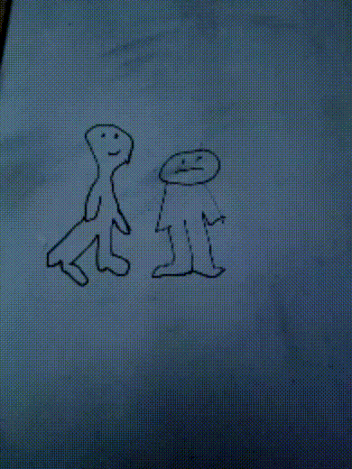
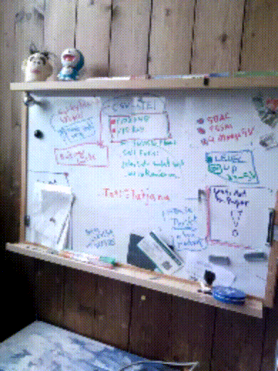
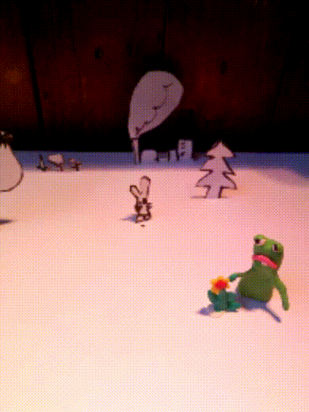

# Stop-o-Moto

This simple app creates videos (MP4) and GIF files from several camera shots and stores them under ''Documents/de.digisocken.stop-o-moto/'' on your device.

Stop-o-Moto uses the open ffmpegAndroid lib to create compatible video files.

- build gif
- tries to build a whatsapp compatible mp4
- delete and reorder images
- "share with..." for fresh created animations

## Get the App

For Android 4.4+ use [APK file](https://gitlab.com/deadlockz/caputhown/raw/master/app/release/de.digisocken.stop_o_moto.apk).

## Examples

## License (my Code)

This is free and unencumbered software released into the public domain.

Anyone is free to copy, modify, publish, use, compile, sell, or distribute this 
software, either in source code form or as a compiled binary, for any purpose, 
commercial or non-commercial, and by any means.

In jurisdictions that recognize copyright laws, the author or authors of this software 
dedicate any and all copyright interest in the software to the public domain. We make 
this dedication for the benefit of the public at large and to the detriment of our 
heirs and successors. We intend this dedication to be an overt act of relinquishment 
in perpetuity of all present and future rights to this software under copyright law.

THE SOFTWARE IS PROVIDED "AS IS", WITHOUT WARRANTY OF ANY KIND, EXPRESS OR IMPLIED, 
INCLUDING BUT NOT LIMITED TO THE WARRANTIES OF MERCHANTABILITY, FITNESS FOR A PARTICULAR 
PURPOSE AND NONINFRINGEMENT. IN NO EVENT SHALL THE AUTHORS BE LIABLE FOR ANY CLAIM, 
DAMAGES OR OTHER LIABILITY, WHETHER IN AN ACTION OF CONTRACT, TORT OR OTHERWISE, 
ARISING FROM, OUT OF OR IN CONNECTION WITH THE SOFTWARE OR THE USE OR OTHER 
DEALINGS IN THE SOFTWARE.

For more information, please refer to [http://unlicense.org](http://unlicense.org)

## Licence (DragListView lib)

Copyright 2014 Magnus Woxblom

Licensed under the Apache License, Version 2.0 (the "License");
you may not use this file except in compliance with the License.
You may obtain a copy of the License at

   http://www.apache.org/licenses/LICENSE-2.0

Unless required by applicable law or agreed to in writing, software
distributed under the License is distributed on an "AS IS" BASIS,
WITHOUT WARRANTIES OR CONDITIONS OF ANY KIND, either express or implied.
See the License for the specific language governing permissions and
limitations under the License.

## Privacy Policy

### Personal information.

Personal information is data that can be used to uniquely identify or contact a
single person. I DO NOT collect, transmit, store or use any personal information while you use this app.

### Non-Personal information.

I DO NOT collect non-personal information like user's behavior:

 -  to solve App problems
 -  to show personalized ads

The Google Play Store collects non-personal information such as the data of install (country and equipment).
I did NOT add any Google or ad keys or codes for marketing feedback, Ads or payment systems!

### Privacy Questions.

If you have any questions or concerns about my Privacy Policy or data processing, please contact me.
