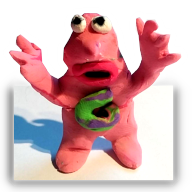
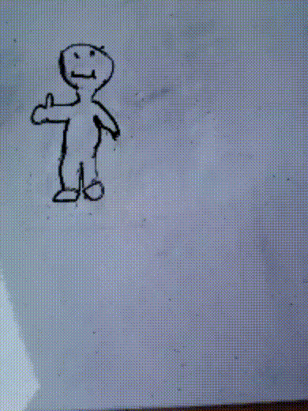

# Stop-o-Moto

Makes small preview images and generates a mp4 file and gif in the `Documents/de.digisocken.stop-o-moto/` folder.

- build gif
- tries to build a whatsapp compatible mp4
- delete or reorder images (tab on image to get option dialog)

## Get the App

For Android 4.4+ use [APK file](https://gitlab.com/deadlockz/caputhown/raw/master/app/release/de.digisocken.stop-o-moto.apk).

## Examples

## License

This is free and unencumbered software released into the public domain.

Anyone is free to copy, modify, publish, use, compile, sell, or distribute this 
software, either in source code form or as a compiled binary, for any purpose, 
commercial or non-commercial, and by any means.

In jurisdictions that recognize copyright laws, the author or authors of this software 
dedicate any and all copyright interest in the software to the public domain. We make 
this dedication for the benefit of the public at large and to the detriment of our 
heirs and successors. We intend this dedication to be an overt act of relinquishment 
in perpetuity of all present and future rights to this software under copyright law.

THE SOFTWARE IS PROVIDED "AS IS", WITHOUT WARRANTY OF ANY KIND, EXPRESS OR IMPLIED, 
INCLUDING BUT NOT LIMITED TO THE WARRANTIES OF MERCHANTABILITY, FITNESS FOR A PARTICULAR 
PURPOSE AND NONINFRINGEMENT. IN NO EVENT SHALL THE AUTHORS BE LIABLE FOR ANY CLAIM, 
DAMAGES OR OTHER LIABILITY, WHETHER IN AN ACTION OF CONTRACT, TORT OR OTHERWISE, 
ARISING FROM, OUT OF OR IN CONNECTION WITH THE SOFTWARE OR THE USE OR OTHER 
DEALINGS IN THE SOFTWARE.

For more information, please refer to [http://unlicense.org](http://unlicense.org)

## Privacy Policy

### Personal information.

Personal information is data that can be used to uniquely identify or contact a
single person. I DO NOT collect, transmit, store or use any personal information while you use this app.

### Non-Personal information.

I DO NOT collect non-personal information like user's behavior:

 -  to solve App problems
 -  to show personalized ads

The Google Play Store collects non-personal information such as the data of install (country and equipment).
I did NOT add any Google or ad keys or codes for marketing feedback, Ads or payment systems!

### Privacy Questions.

If you have any questions or concerns about my Privacy Policy or data processing, please contact me.
